# 👋 Hola, soy Néstor Patiño – `D4NEST`

### Director Creativo & Desarrollador Full‑Stack

---

## ✨ Sobre mí

🎨 **De la idea al código**: lidero proyectos desde la dirección creativa hasta el backend, integrando arte, datos y tecnología.  
🤖 Apasionado por **optimizar flujos de trabajo con IA** y metodologías ágiles.  
🎧 Productor musical y editor multimedia en mis ratos libres.  
🌎 **Ubicación**: Venezuela 🇻🇪 -  Argentina 🇦🇷   (intermitente)

---

## 📌 Fortalezas clave

- Optimizador de productividad con IA  
- UI/UX y diseño web
- Producción multimedia y dirección de arte  
- Versatilidad y trabajo en equipo  
- Metodologías ágiles (Scrum/Kanban)

---

## 🛠️ Stack tecnológico

### 💻 Desarrollo backend y frontend

### 🗄️ Bases de datos y herramientas

### 🎨 Diseño, audio y video

---

## 🚀 Proyectos destacados

> *Edita estos enlaces con tus repositorios reales*

- [**meta-modelador de bases de datoss**](https://github.com/D4NEST/portafolionest) – Sistema de gestion empresarial Adaptable por Rubros .
- [**Modulo De Inventario  flask **](https://github.com/D4NEST/inventario-soluciones-logicas) – HTML/CSS/JS con diseño responsive y optimización y test py.
- [**Mvc Php "Erp Clinica"**](https://github.com/D4NEST/api-music) – Backend mySql  (Xampp) para gestiónar citas , Consultas, Tareas pendientes, generar Backups, almacenar info cliente

---

## 🎓 Educación destacada

- **Técnico Superior en Informática** – Iutirla 
- **Producción Musical** – Tecson (2016‑2019)  
- **Oratoria y Locución** – Formación complementaria  
- **Metodologías Ágiles** (Scrum, Kanban)

---

## 🌎 Idiomas

- **Español** – nativo  
- **Inglés** – básico (en aprendizaje activo)

---

## 📫 Contacto

- 📞 (+58) 0412-231-8903  
- 🌍 Venezuela / Argentina (viajero frecuente)

---

## 📈 GitHub Analytics

## 📈 GitHub Analytics

> *“No solo escribo código, construyo experiencias. Arte que funciona, código que emociona.”*
